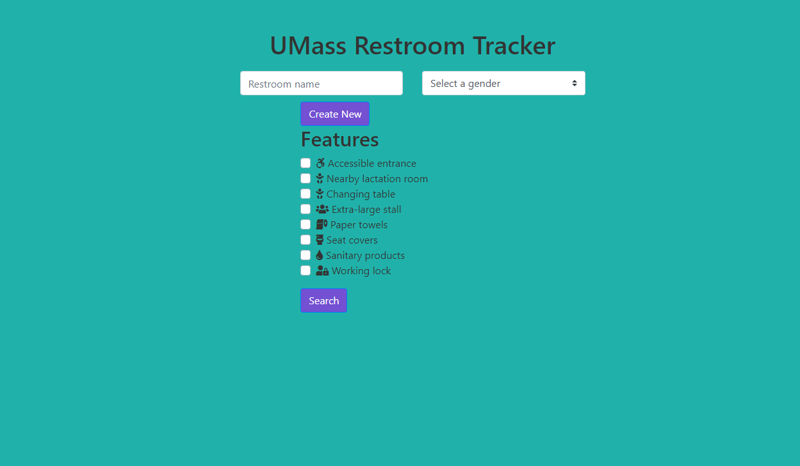
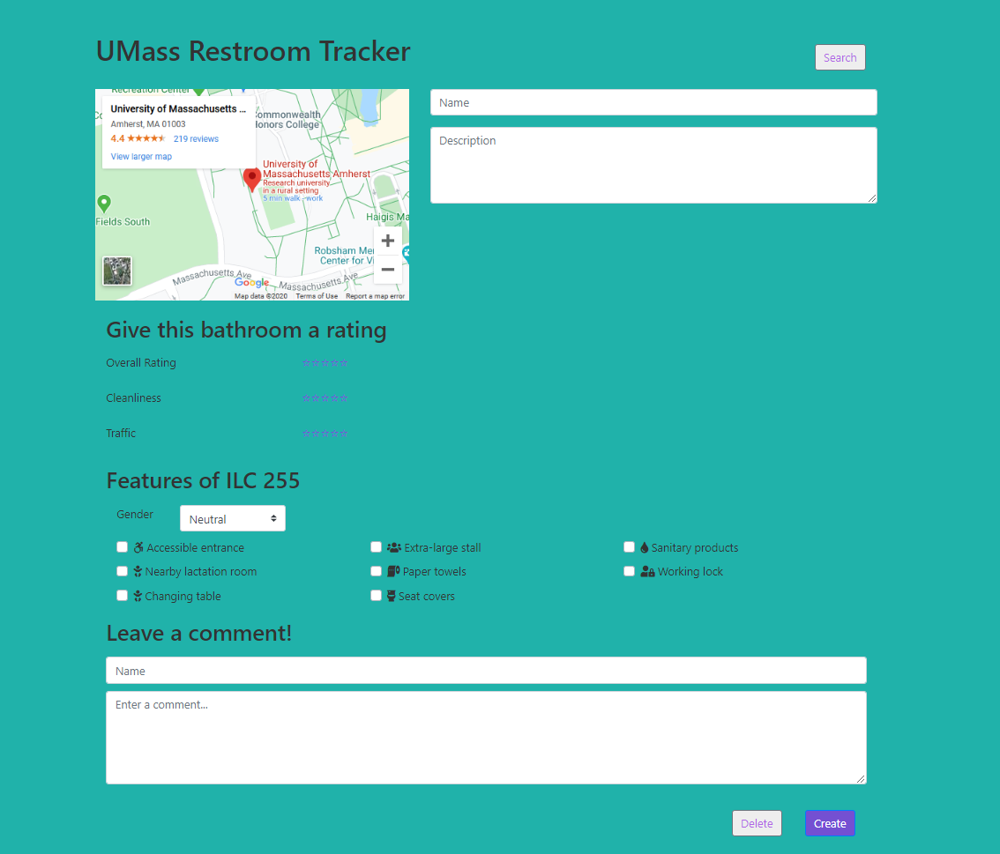
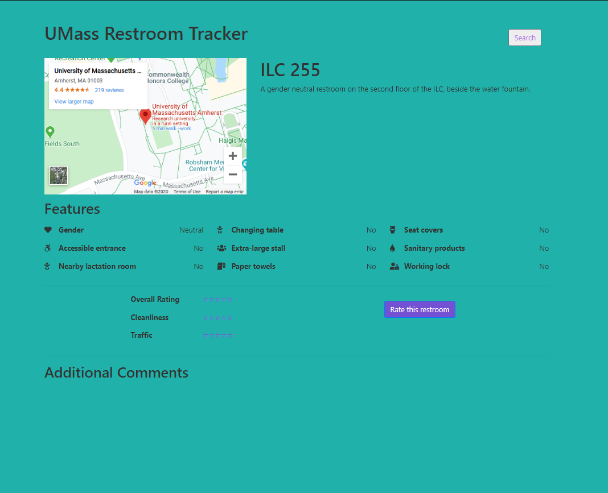
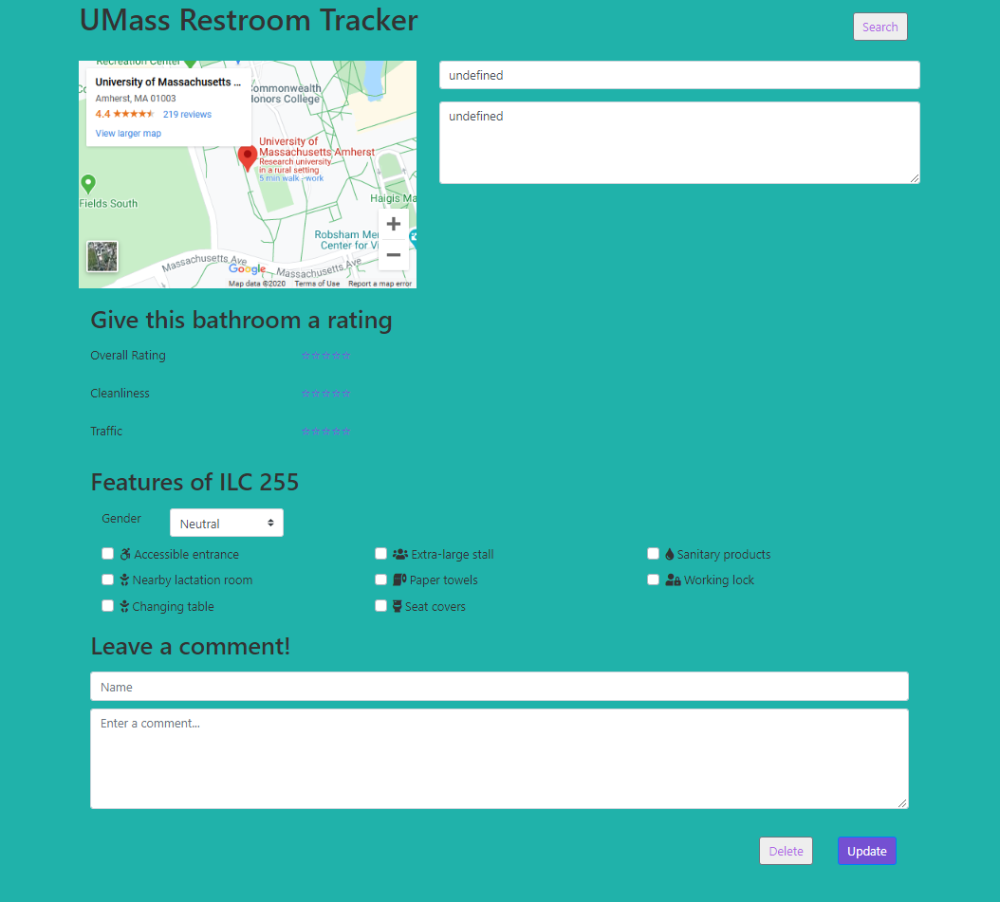

# Team Alef

## UMass Restroom Tracker
### Spring 2020

## Overview 
Our application is a database of bathrooms on the UMass campus, and an interface for users to rate and comment about them, similar to Yelp or IMDB. It allows people to see where the nearest bathroom is and users are able to filter through bathroom requirements (such as having a changing table, being accessible to them, female product disposal, and so on). Ratings would be averaged and displayed.

A current service does not currently exist for UMass. We hope to make the campus more accessible with this application, particularly for people with disabilities and trans people, as well as anyone else for whom particular features are beneficial (e.g., changing table, sanitary products).

## Team Members
* Sam Dziewietin (@samdzie)
* Ankita Kumar (@Ankita-Kumar)
* Raymond Tan (@raymond98tan)

## User Interface
### Home

From this page, users may filter restrooms by building, gender, accessible entrance, nearby lactation room, changing table, extra large stalls, paper towels, seat covers, sanitary products, and a lock.
### Add Restroom

This page comes up when the user clicks the "Create New" button on the home page. From this page, users are able to input their own bathroom into the database, providing the name, description, rating, features, as well as the first comment.
### Restroom view

This page comes up when users click "Search" from the home page and it displays the results of filtering.
### Rating submission page

This page comes up when users click the "Rate this restroom" button. From here, users are able to give a rating for the bathroom and leave their comments on it.

## APIs
API documentation is available [here](https://docs.google.com/document/d/1c31cUi0dC66n8w7lVmq3Tw-KCG-3hsgRvamOfF9ZKB4/edit?usp=sharing).

## Database
### Restroom collection
Information about each restroom is stored in a Restroom object, defined [here](/classes/restroom.ts). Each restroom is assigned a unique ID and stored as a document in this collection. Each Restroom object contains a [Features object](/classes/restroom.ts) and a [CommentSection object](/classes/comments.ts) to represent the contained data.

```javascript
restroom document
{
  _id: <ObjectId1>,
  name: String,         // the restroom's unique ID
  value: Restroom       // the Restroom object
}
```

### Metadata collection
This collection contains arrays of post IDs used for managing used IDs and categorizing entries. For example, the `usedIDs` array keeps track of used IDs to ensure all newly-generated IDs are unique.

```javascript
metadata document
{
  _id: <ObjectID1>,
  name: String,         // a key
  value: Array<number>  // an array of post IDs
}
```

## URL Routes/Mappings
Route | Description
----- | -----------
`/` | Serves the [static](/static) directory, defaulting to [index.html](/static/index.html)
`/restroom` | Serves the [restroom view page](/static/restroom.html) when followed by a URL query `?id=[SOME-ID]`
`/update` | Serves the [update page](/static/update.html), allowing users to update the restroom specified by a URL query `?id=[SOME-ID]`
`/restroom/create` | Restroom create functionality
`/restroom/read` | Restroom read functionality
`/restroom/update` | Restroom update functionality
`/restroom/delete` | Restroom delete functionality
`/restroom/getall` | Returns a list IDs corresponding to all restrooms in the database

## Division of Labor
We divided both frontend and backend implementations based on functions. Sam implemented the creation and updating of the restroom database, Ankita worked on the searching feature, and Raymond worked on the login and google maps APIs. Overall, the contributions were :
* Sam - index.html and its wireframe, restroom.html and its wireframe, style.css, the repo's file structure, restroom CRUD, backend skeleton, MongoDB configuration, back-end CRUD for restroom entries
* Ankita - login.html and its wireframe, update.html and its wireframe, style.css, search client and server
* Raymond - part of index.html, wireframes, found and added icons for the features, login client, Google map API

## Conclusion
Working on this project, we learned the importance of designing and creating wireframes to visualize our endgoal before writing any code. We learned about the many important parts in putting a website together which include HTML, CSS, Bootstrap, TypeScript, databases, servers, ports, Heroku, etc.

Checking out and merging branches, as well as making pull requests, were valuable skills that we learned through collaborating with git. We wished that we had experience with resolving merge conflicts before working on this project, as it was a somewhat confusing skill to learn.

A difficulty we encountered with the project was trying to figure out how to connect the database searching function to the server-client implementation. Another difficulty we had was with connecting the query with the string of the actual bathroom location for the Google Maps API. Our team also struggled in figuring out how to connect our client to Heroku.
