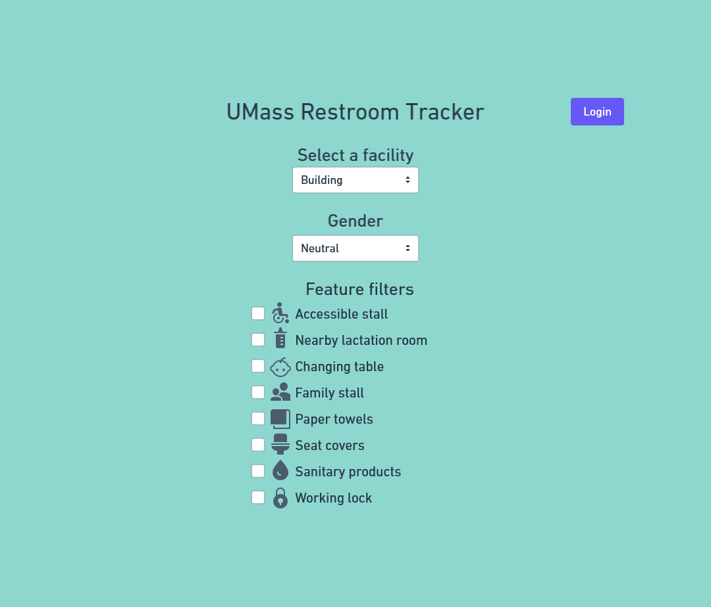
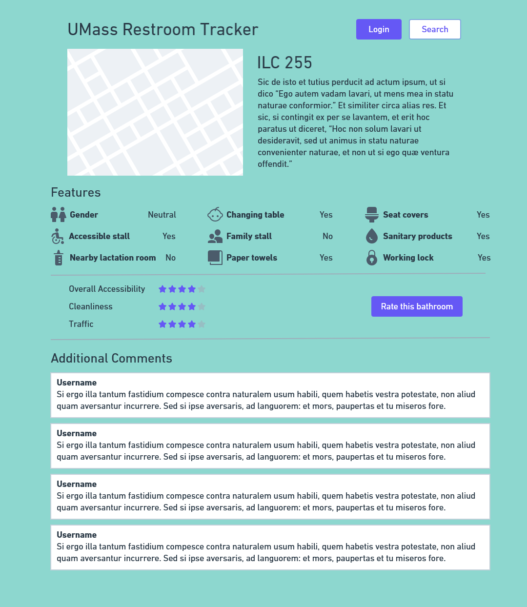
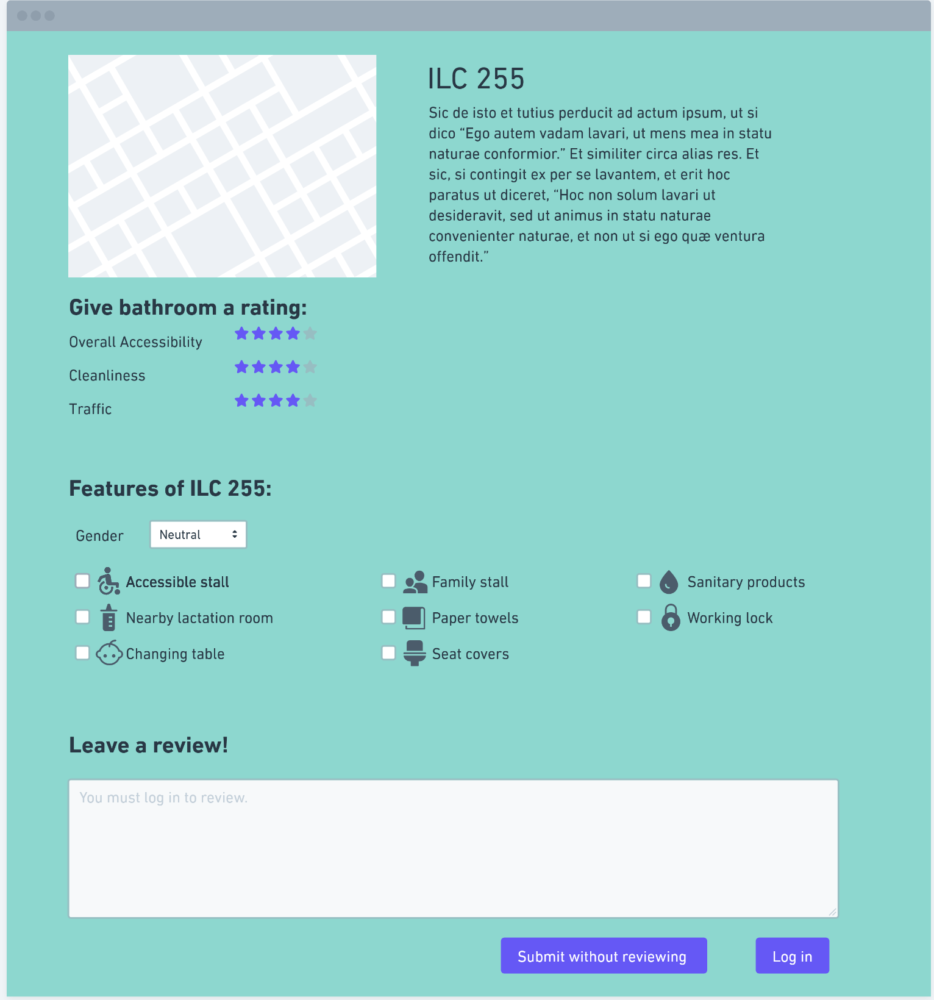
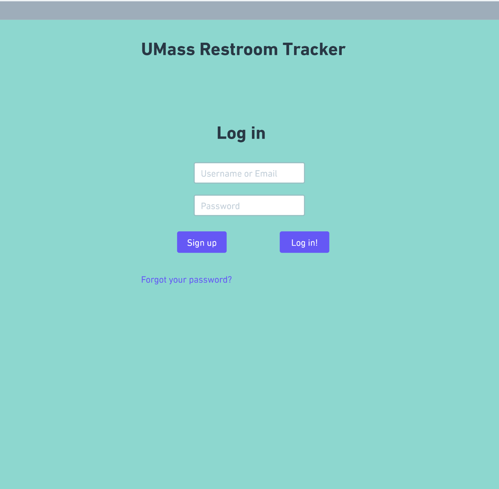
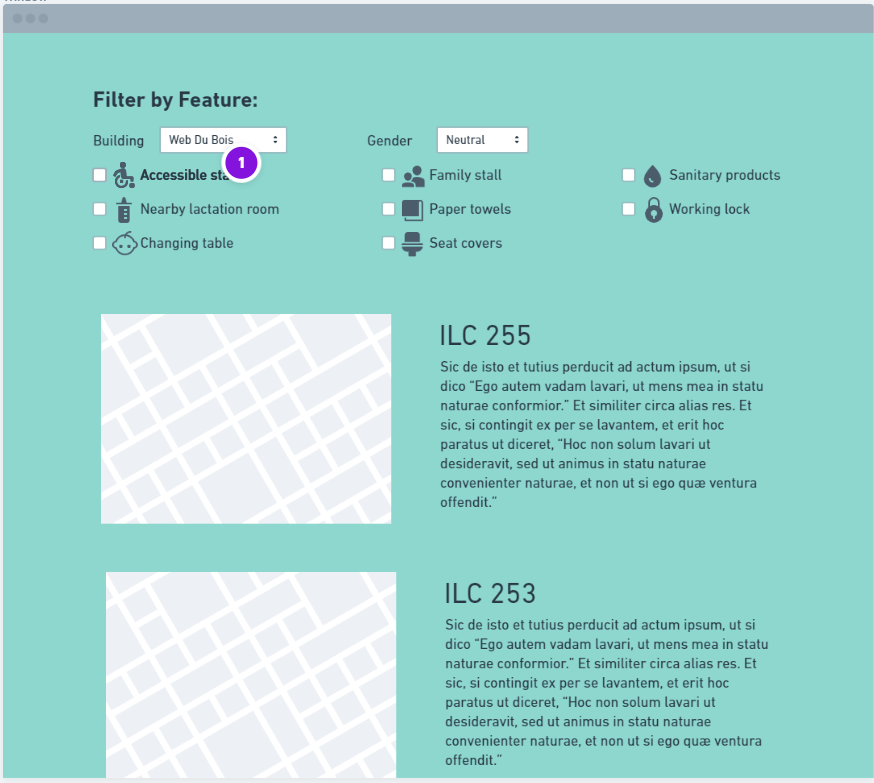
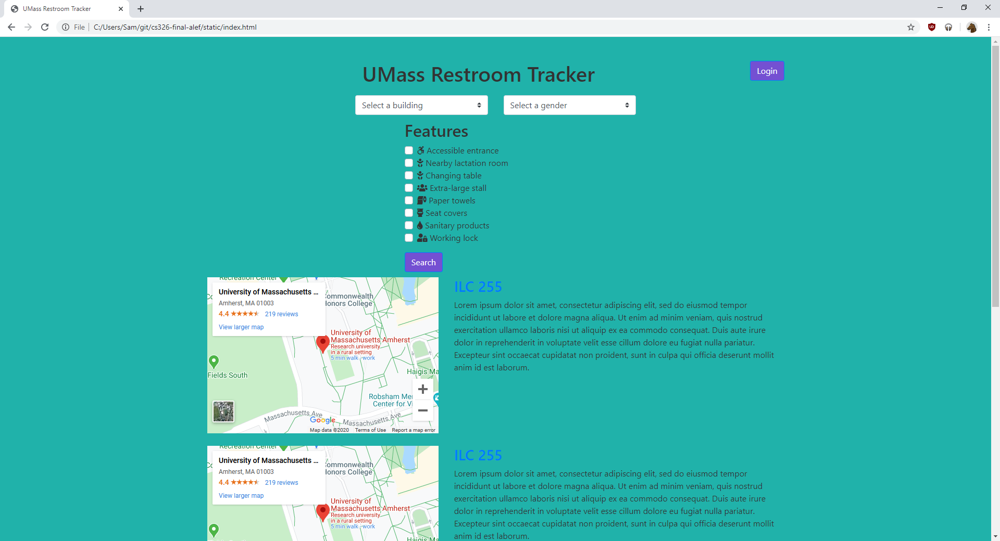
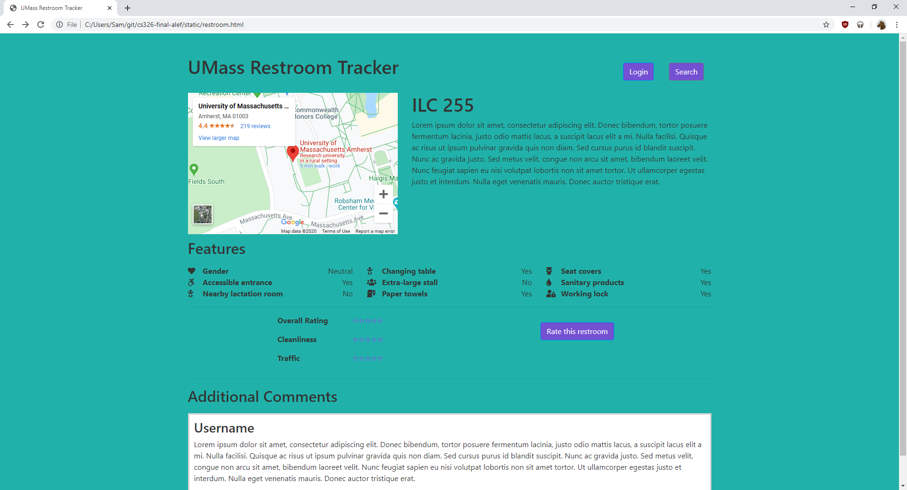
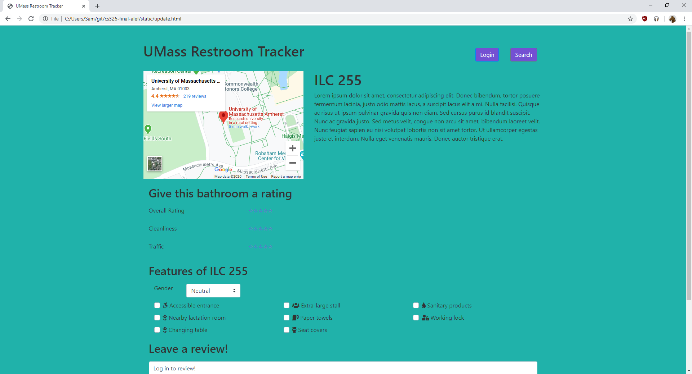
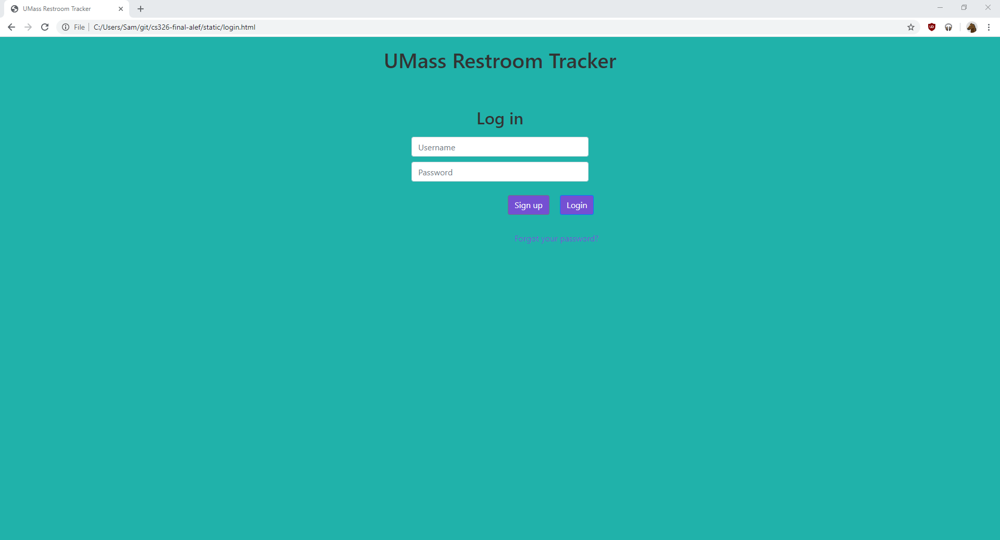

# Milestone 1: Data Interactions

## Data Interactions
* Location description
* Category
    * Restroom
    * Lactation room
* Features
    * Wheelchair accessible
    * Gender-neutral
    * Sanitary product dispenser
    * Changing table
    * Single stall
* Cleanliness rating
* Additional comments

## Wireframes
### Home

### Restroom View

### Rating submission page

### Login page

### Search results page

## Mockups
### Home

### Restroom view

### Rating submission page

### Login page

## Division of labour
* Sam - index.html, restroom.html, and their wireframes; style.css; made the different folders and file structure
* Ankita - login.html, update.html, and their wireframes; style.css; 
* Raymond - results.html (merged into index.html) and its wireframe; found and added icons for the features
